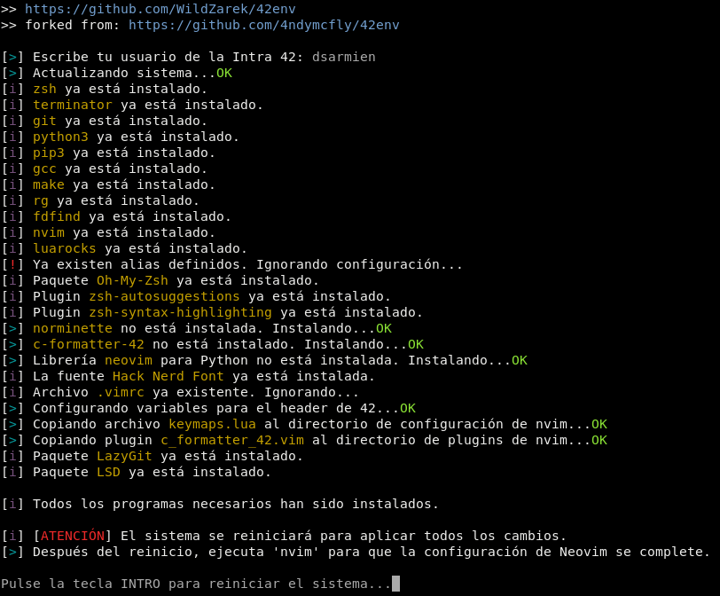

<div align="center">
  
  <p>42 ENVironment Configuration Script</p>
</div>

# Descripción

Automatiza la instalación y configuración del entorno básico necesario para programar en el Cursus de 42.<br>
Testeado en las siguientes distribuciones (INFORMACIÓN TEMPORAL):

| Distribución                                                   | Codename      | Estado |
| ----------------                                               | ------------- | ------ |
| [Ubuntu 22.04 LTS (WSL)](https://releases.ubuntu.com/jammy/)   | Jammy         | ?      |
| [Ubuntu 24.04 LTS (WSL)](https://releases.ubuntu.com/noble/)   | Noble         | F      |
| [Debian 12 LTS (WSL)](https://www.debian.org/releases/stable/) | Bookworm      | F      |

# Problemas Conocidos

Es posible que la ejecución de `42env.sh` en algunos entornos basados en `WSL (Windows Subsystem for Linux)` ocasione ciertos problemas relacionados con la instalación de paquetes con `pip/pip3`. La solución más simple es instalar `pipx` o bien crear un `virtualenv` en el que instalar estos paquetes (lo cual es recomendable).
Luego es necesario incluir el directorio 'bin' del virtualenv en el PATH del sistema para que se pueda llamar a los binarios correspondientes desde fuera del mismo.

Al finalizar la ejecución del script, en el momento que se nos pide reiniciar el sistema, también nos dará error si estamos usando Debian bajo WSL, esto es debido a que no podemos hacer `sudo reboot` como haríamos normalmente en nuestra máquina virtual. La solución es tan simple como cerrar WSL con el comando `exit` y volver a lanzar nuestra distro bajo WSL. Las distribuciones que tengan estos problemas están marcadas con el estado `F`.

# Índice

1. [Software](#software)
2. [Recomendaciones](#recomendaciones)
3. [Instalación](#instalación)
4. [Durante la ejecución](#durante-la-ejecución)
5. [Neovim](#neovim)
    - [Uso básico de NeoVim](#uso-básico-de-neovim)
6. [Extras](#extras)
    - [Oh-My-Zsh](#oh-my-zsh)
    - [zsh-autosuggestions](#zsh-autosuggestions)
    - [zsh-syntax-highlighting](#zsh-syntax-highlighting)
    - [LSD (LSDeluxe)](#lsd-lsdeluxe)
    - [BAT (batcat)](#batcat)
    - [xclip](#xclip)
    - [LazyGit](#lazygit)
7. [En proceso...](#en-proceso)

# Software

Este script instala el siguiente software en el caso de que no esté instalado:

- **zsh |** [Shell ZSH](https://www.zsh.org/)
- **oh-my-zsh |** [Oh-My-Zsh](https://ohmyz.sh/)
- **zsh-autosuggestions |** [Plugin zsh-autosuggestions](https://github.com/zsh-users/zsh-autosuggestions)
- **zsh-syntax-highlighting |** [Plugin zsh-syntax-highlighting](https://github.com/zsh-users/zsh-syntax-highlighting)
- **terminator |** [Terminator](https://gnome-terminator.org/)
- **git |** [Git Fast Version Control](https://git-scm.com/doc)
- **python3 |** [Python 3.11.2](https://www.python.org/downloads/release/python-3112/)
- **pip3 |** [Package Installer for Python](https://pip.pypa.io/en/stable/)
- **ripgrep |** [Recursively searches by regex pattern](https://github.com/BurntSushi/ripgrep)
- **fd / fd-find |** [Simply alternative to 'find'](https://github.com/sharkdp/fd)
- **luarocks |** [Package manager for Lua modules](https://luarocks.org/)
- **neovim |** [Hyperextensible Vim-based text editor](https://neovim.io/) + vim-plug + 42 plugins
- **nerd fonts |** [Iconic font aggregator, collection, and patcher](https://www.nerdfonts.com/) | Hack Nerd Font
- **lsd |** [The next gen ls command](https://github.com/lsd-rs/lsd)
- **bat |** [A cat clone with wings](https://github.com/sharkdp/bat)
- **xclip |** [Command line interface to the X11 clipboard](https://github.com/astrand/xclip)
- **lazygit |** [Simple terminal UI for git commands](https://github.com/jesseduffield/lazygit)
- Atajos de teclado para 'nvim' y config para .zshrc

# Recomendaciones previas

> [!WARNING]
> Antes de comenzar el proceso se recomienda hacer copia de seguridad o un snapshot del estado actual de la máquina virtual. Este script está pensado para uso en nuestro ordenador personal.

# Instalación


Primero clonamos este repositorio y entramos en la carpeta `42env` creada.

```bash
git clone https://github.com/WildZarek/42env.git; cd 42env
```

Asigna permisos de ejecución al script y ejecútalo. Se recomienda tener siempre maximizada la ventana de la shell.

```bash
chmod +x 42env.sh; ./42env.sh
```



# Durante la ejecución

Al ejecutar el script, te pedirá tu usuario de la Intra 42, escríbelo y pulsa `Enter`<br>
Este usuario se usará para configurar el header de 42 para nvim.

Una vez que haya terminado todo el proceso, pulsa la tecla `Enter` y se reiniciará el equipo.<br>
Después de arrancar el sistema, abre Terminator, maximiza la ventana y ejecuta `nvim`, acto seguido escribe `:PlugInstall` para que se complete la configuración de Neovim.

```bash
nvim
```

Si no pulsas con el ratón en la ventana de instalación, puede que el instalador te pida que pulses una tecla.<br>
Si es tu caso, pulsa la tecla `Espacio`. La configuración continuará y finalizará cuando te solicite que pulses `Enter`.

# NeoVim

Si ejecutas `nvim` sin ningún nombre de archivo, se abrirá a la izquierda el explorador de archivos en la ruta actual para que puedas navegar entre las distintas carpetas y archivos. Si se ejecuta pasando un nombre de archivo, entonces el foco cambia directamente a la ventana del archivo.


## Uso básico de NeoVim

En NeoVim se han definido multitud de atajos de teclado para el uso diario que funcionan solo en el modo NORMAL y nos facilitan la tarea de escribir codigo:

**Tecla <kbd>F1</kbd>:** Inserta el header de 42 y pone el editor en modo `Insert`.


**Tecla <kbd>F2</kbd>:** Formatea automáticamente el código siguiendo la Norma para presentarlo a la `norminette`.


**Tecla <kbd>F3</kbd>:** Ejecuta `norminette` con las flags `-R CheckForbiddenSourceHeader` sobre el archivo actual.


**Tecla <kbd>Ctrl</kbd>+<kbd>q</kbd>:** Fuerza el cierre de la ventana activa [Equivale a `:q!`]

**Tecla <kbd>Ctrl</kbd>+<kbd>s</kbd>:** Guarda el documento activo [Equivale a `:w`]

**Tecla <kbd>Ctrl</kbd>+<kbd>f</kbd>:** Guarda y cierra el documento activo [Equivale a `:wq`]

**Tecla <kbd>F4</kbd>:** Abre o cierra el explorador de archivos.


> [!NOTE]
> Puedes ver los demás [atajos de teclado aquí](#atajos-de-teclado-neovim)

# Extras

## Oh-My-Zsh

<strong>Oh My Zsh</strong> es una capa de personalización en formato framework que se instala sobre Zsh. Proporciona una amplia gama de características y mejoras, como autocompletado avanzado, atajos de teclado, sugerencias de comandos, temas personalizables y una amplia biblioteca de plugins.

## zsh-autosuggestions

<strong>zsh-autosuggestions</strong> es un plugin que a medida que escribimos un comando, nos sugiere y recuerda comandos escritos anteriormente (que residen en el historial de la terminal) en color gris de fondo, para que sea más sencillo para nosotros identificarlos. Pulsando la tecla <kbd>→</kbd> le decimos a zsh que lo recupere íntegro, lo que puede ser útil para comandos largos. Similar a como lo hace la shell `fish` por defecto.

## zsh-syntax-highlighting

<strong>zsh-syntax-highlighting</strong> proporciona resaltado de color de comandos, el cuál viene de una característica que incorporaba inicialmente la shell `fish`. Al escribir un comando en la terminal nos aparecerá en rojo si no está instalado en el sistema o en verde si está disponible para utilizar. De esta forma sabremos, a medida que vamos escribiendo los comandos, si los estamos escribiendo bien (o por lo contrario, tenemos erratas) o si no se encuentra instalado un comando, por ejemplo, incluso antes de pulsar la tecla <kbd>ENTER</kbd>

## LSD (LSDeluxe)

Se incluye `lsd` ya que mejora la legibilidad en la terminal aprovechando las <strong>Hack Nerd Fonts</strong> instaladas en el sistema. El alias `ll` equivale a:

```bash
/usr/bin/lsd -lha --group-dirs=first
```


Si por comodidad queremos ver los permisos de los archivos y carpetas en base octal, `llo` es un alias de:

```bash
/usr/bin/lsd -lha --group-dirs=first --permission octal
```


## BAT (batcat)

<strong>bat</strong> es una alternativa moderna al clásico comando `cat` de Linux. Ofrece algunas características únicas, como números de línea de impresión bonita, paginación y resaltado de sintaxis.

El alias `bat` (admite un parámetro para indicar el nombre del archivo) equivale a:

```bash
/usr/bin/batcat <filename>
```

## xclip

<strong>xclip</strong> es una aplicación que nos permite introducir texto en el portapapeles y recuperar texto de él desde la línea de comandos. El texto recuperado puede haber sido introducido por cualquier otra aplicación.

Asímismo, el texto que se introduce en el portapapeles a través de <strong>xclip</strong> puede ser utilizado por cualquier otra aplicación.

Ejemplos de uso:
```bash
echo "Hola mundo" | xclip -i
```

El texto «Hola mundo» pasará a estar disponible para el resto de aplicaciones.
Del mismo modo, para recuperar el texto del portapapeles y enviarlo a la salida estándar debe especificarse la opción `-o`:

```bash
xclip -o
Hola mundo
```

Podemos usar pipes para enviar al portapapeles lo que queramos, por ejemplo el contenido completo de un archivo:

```bash
cat archivo.txt | xclip
```

En definitiva, es una herramienta muy útil que nos ahorra tiempo a la hora de trabajar con el portapapeles.

## LazyGit

LazyGit es ideal para quienes prefieren usar la terminal pero quieren una forma más cómoda y rápida de manejar Git sin tener que escribir todos los comandos manualmente. Resulta especialmente útil para desarrolladores que trabajan con repositorios grandes y complejos, ya que facilita la visualización de los cambios y permite moverse ágilmente entre las distintas secciones del repositorio.

> [!NOTE]
> ¡Por probarlo no pierdes nada!

<div align="center">
  
</div>

## Atajos de teclado NeoVim

> [!NOTE]
> Estos atajos son para utilizar en el modo **NORMAL**

| Atajo | Descripción |
| --- | --- |
| `F1` | Añade el header de 42 |
| `F2` | Aplica auto-formato al código C en base a la Norma v3 de 42 |
| `F3` | Ejecuta Norminette sobre el archivo actual y muestra los errores de norma |
| `F4` | Muestra u oculta explorador de archivos NERDTree |
| `F5` | Muestra u oculta el plugin Tagbar a la derecha |
| `Ctrl` + `q` | Cierra la ventana actual sin guardar los cambios (:q!) |
| `Ctrl` + `s` | Guarda los cambios en el documento actual (:w) |
| `Ctrl` + `f` | Guarda los cambios en el documento actual y cierra Nvim (:wq) |
| `Ctrl` + `h` | Cambia el foco a la división del lado izquierdo |
| `Ctrl` + `l` | Cambia el foco a la división del lado derecho |
| `Ctrl` + `j` | Cambia el foco a la división del lado inferior |
| `Ctrl` + `k` | Cambia el foco a la división del lado superior |
| `Ctrl` + `↑` | Cambia el tamaño de la división activa hacia arriba (horizontalmente) |
| `Ctrl` + `↓` | Cambia el tamaño de la división activa hacia abajo (horizontalmente) |
| `Ctrl` + `←` | Cambia el tamaño de la división activa hacia la izquierda (verticalmente) |
| `Ctrl` + `→` | Cambia el tamaño de la división activa hacia la derecha (verticalmente) |

# Terminal

## Terminator
<div align="center">
  
</div>

<strong>Terminator</strong> es una excelente opción si buscas un emulador de terminal que combine velocidad, personalización y funcionalidad avanzada, ideal para usuarios que desean aprovechar al máximo su entorno de trabajo en la terminal. Permite dividir la pantalla en varias terminales dentro de una misma ventana, facilitando la multitarea sin necesidad de usar múltiples ventanas. Terminator es un proyecto de código abierto con un desarrollo activo, lo que significa que recibe actualizaciones frecuentes y mejoras continuas.

## Atajos de teclado (Terminator)

| Atajo | Descripción |
| --- | --- |
| `Ctrl` + `Shift` + `Q` | Finaliza la ejecución de Terminator |
| `Ctrl` + `Shift` + `W` | Cierra la terminal o la ventana activa |
| `Ctrl` + `Shift` + `I` | Abre una nueva ventana (la cual es parte del proceso actual de Terminator)
| `Ctrl` + `Shift` + `T` | Abre una nueva pestaña en el directorio actual |
| `Ctrl` + `Shift` + `O` | Divide la terminal horizontalmente |
| `Ctrl` + `Shift` + `E` | Divide la terminal horizontalmente |
| `Ctrl` + `Shift` + `→` | Modifica el tamaño de la terminal verticalmente |
| `Ctrl` + `Shift` + `←` | Modifica el tamaño de la terminal verticalmente |
| `Ctrl` + `Shift` + `↑` | Modifica el tamaño de la terminal horizontalmente |
| `Ctrl` + `Shift` + `↓` | Modifica el tamaño de la terminal horizontalmente |
| `Ctrl` + `Shift` + `S` | Oculta/Muestra la barra de scroll de la terminal activa |
| `Ctrl` + `Shift` + `F` | Muestra la barra de búsqueda |
| `Ctrl` + `Shift` + `N` | Cambia a la siguiente terminal en la misma pestaña |
| `Ctrl` + `Shift` + `P` | Cambia a la anterior terminal en la misma pestaña |
| `Ctrl` + `Shift` + `X` | Cambia entre mostrar todas las terminales o maximizar la actual |
| `Ctrl` + `Shift` + `Z` | Cambia entre mostrar todas las terminales o una visión ampliada de la actual (zoom) |
| `Ctrl` + `PageDown` | Cambia a la siguiente terminal |
| `Ctrl` + `PageUp` | Cambia a la terminal anterior |
| `Alt` + `→` | Cambia a la terminal justo a la derecha de la actual |
| `Alt` + `←` | Cambia a la terminal justo a la izquierda de la actual |
| `Alt` + `↑` | Cambia a la terminal justo encima de la actual |
| `Alt` + `↓` | Cambia a la terminal justo debajo de la actual |
| `Ctrl` + `Shift` + `C` | Copia el texto seleccionado a la clipboard |
| `Ctrl` + `Shift` + `V` | Pega el contenido de la clipboard a la terminal actual |
| `Ctrl` + `Plus` (+) | Aumenta el tamaño de la fuente para la terminal actual (es posible que debas presionar `Shift` dependiendo del teclado) |
| `Ctrl` + `Minus` (-) | Reduce el tamaño de la fuente para la terminal actual (es posible que debas presionar `Shift` dependiendo del teclado) |
| `Ctrl` + `Zero` (0) | Reinicia el tamaño de la fuente para la terminal actual (a los valores de configuración por defecto) |
| `F11` | Activa o desactiva la pantalla completa |
| `Ctrl` + `Shift` + `R` | Reinicia el estado de la terminal |
| `Ctrl` + `Shift` + `G` | Reinicia el estado de la terminal y limpia la pantalla |

# En proceso...
En el futuro se publicará una versión del proyecto para su instalación en entornos Android bajo Termux.

> [!NOTE]
> Si consideras útil este proyecto, apóyalo dando <strong>★ Star</strong> en el repositorio. ¡Gracias!

# ¡Happy hacking & coding! 😎

[Volver al índice](#índice)